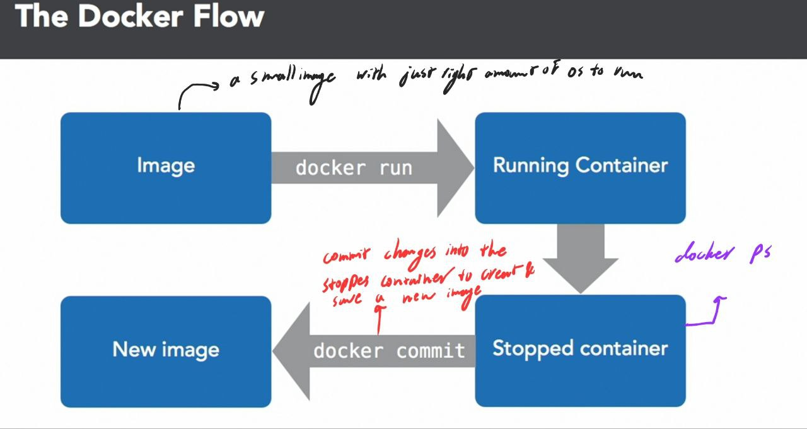

```
$ docker run -ti ubuntu:latest bash
```

This runs an ubuntu and the `-ti` command stands for terminal interactive.

```
$ docker ps -l 
```

Shows the latest stopped container. If you have creat changes into the container, you should commit those changes and
creat a new image. To do so, use the `NAMES` field of the above command and run the following command to commit the
image:

```
$ docker commit <NAMES> <NEW IMAGE NAME>
```

The docker flow would be as follows:



`--rm` is a common argument used to remove the container after doing some operations.

```
$ docker run --rm -ti ubuntu sleep 5 
$ docker run --rm -ti ubuntu sleep 5 
```

To creat a detached container, meaning that you start a container and just let it run, use the following command:

```
$ docker run -d -ti ubuntu bash 
```

Then, if you want to reattach it, use

```
docker attach {NAMES}
```

Or you can use ctrl + p and ctrl + q to detach and reattach. If you want to execute a process within another container,
you would use `exec` command. E.g. here, we run a bash in the {NAMES} container.

```
$ docker exec -ti {NAMES} bash
```

With `docker logs <container name>` one can find out what went wrong within a container. For example:

```
$ docker run --name example -d ubuntu bash -c "lose /etc/password"
```

after running `docker logs example`, it says `bash: lose: command not found`. To stop or remove a container, use:

```
$ docker kill <container name>
$ docker rm <container name>
```

You can limit the amount of memory by the following:

```
docker run --memory <max allowed memory> <image name> <command>
```

You can specify CPU shares for each container by:

```
docker run --cpu-shares <relative to other containers>
```

or equally you can enforce the CPU limitation by:

```
docker run --cpu-quota <like 10% of the CPU ever>
```

Hint: don't let your containers fetch dependencies when they start. If someone removes some library or change some
package in the remote, it creates lots of errors for your container.

### Network

Networking is a common way to connect different containers to each other. First, you should create a network using the
following:

```
$ docker network create <network name>
```

which creates a network <name>. Then you can run containers over this network. Here is an example:

```
$ docker run --rm -ti --net <network name> --name <container 1> ubuntu:14.04 bash 
```

and we create another container named `<container 2>` over the same network. Then we can ping other containers using
their names from one another.

Docker uses bridges to create virtual networks on a computer. To turn off this feature, which is essential in protection
for the production mode, one should pass `--net=host` to the `docker run`. 
### Volumes

Virtual discs to store and share data across containers. There are two kinds:

* Persistent: stays there on the host even after the container goes away.
* Ephemeral: exists as long as the container is using it. To create a shared folder, use the following command:

```
$ docker run -ti -v <host folder>:<container folder> ubuntu bash
```

this way, by creating any file under the container folder, it would be there on the host folder, too. To create a shared
volume across containers, which will be removed when no container is using it, use the following command:

```
$ docker run -ti -v <directory> ubuntu bash
```

then run another container to inherit the same volume:

```
$ docker run -ti --volumes-from <the container name to inherit the volume from> ubuntu bash
```

### Registries

Registries are used to register some image or find and download images from the docker. You can find images by using
the `search` command:

```
$ docker search <image name>
```

### Dockerfile

A small program to create an image and this program is run using:

```
docker build -t <name of the image> <location to the directory containing the Dockerfile> 
```

Each line in the dockerfile takes the image from the previous line and makes another image. The previous image is
unchanged. The dockerfile uses caching and if you run a line before, it won't rerun it if it does not see any changes.
Then you can run the created image using docker run. For more information and examples on writing a Dockerfile, visit
[here](https://docs.docker.com/engine/reference/builder/). Here are some other useful commands:

* FROM specifies what image to start with. You can also use the previously created docker images (created by running
  other Dockerfiles) with the FROM statement to add more things to the container. One can add multiple FROM statements.
* RUN after creating a container, runs some commands during the build process, waits for it to finish, and saves teh
  result.
* MAINTAINER defines the author of the Dockerfile. An example would
  be `MAINTAINER Firstname Lastname <email@example.com>`
* ADD adds local files. It also adds the contents of tar archives. Example would be `ADD project.tar.gz /install/` which
  uncompresses the `project.tar.gz`'s contents into the /install/ directory. It can also be used to download contents
  from a URL into a directory, e.g. `ADD <url> <path>`.
* ENV sets environment variables both during the build and running of the image.
  E.g. `ENV DB_HOST=db.production.example.com`
* CMD when the image started, it runs this command.
* ENTRYPOINT specifies the start of the command to run.
    * Check the difference of ENTRYPOINT and CMD and their application
    * Both ENTRYPOINT and CMD can use either shell or exec forms. The shell form calls to a shell such as bash to run
      the command; e.g. `nano notes.txt`. Exec runs directly without calling a shell; e.g. `["/bin/nano", "/notes.txt"]`
      .
* EXPOSE maps a port into the container, e.g. `EXPOSE 8080`
* VOLUME defines shared or ephemeral volumes. Using `VOLUME ["<host path>", "<container path>"]`, one can create a path
  shared between the host and the container. Using the `VOLUME ["<shared path>"]`, the container creates some path that
  can be inherited by other containers. Avoid using shared volumes with the host because you want to use this container
  on other computers, too.
* WORKDIR sets the directory of the future runs in the Dockerfile and the resulting image.
* USER sets which user the container will run as. Useful in shared networks.

### Multi-Stage builds

To make the saved images smaller, one can split the building process of the image. Take the following dockerfile as
example:

```
FROM ubuntu:16.04 as builder
RUN apt-get update
RUN apt-get -y install curl
RUN curl https://google.com | wc -c > google-size

FROM alpine
COPY --from=builder /google-size /google-size
ENTRYPOINT echo google is this big; cat google-size
```

Instead of installing curl and adding it to image, we download it to a temporary container, get the results from Google,
and copy the content of the resulting file from that container using alpine. This makes the resulting image much more
lighter.

### Kernels

Core of every computer.

* It runs directly on the hardware and receives messages from it. E.g. would be what packets have arrived, which new
  hardware is connected, etc.
* It starts and schedule programs.
* Control and organize storage, such as write to and read from files.
* Pass messages between programs. 
* Allocate resources, memory, CPU, network, and so on.
Docker is a program which manages kernel. It uses `cgroups` to contain processes, `namespaces` to contain netowrks, and 
`copy-on-write` filesystems to build images.

### Notes
* Docker images are read only.
